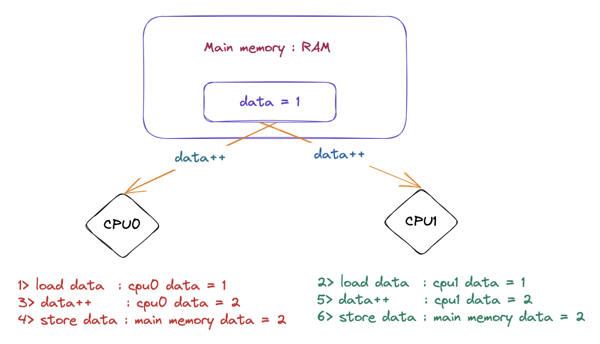

# OpenMP 原子指令设计与实现

## 前言

在本篇文章当中主要与大家分享一下 openmp 当中的原子指令 atomic，分析 `#pragma omp atomic` 在背后究竟做了什么，编译器是如何处理这条指令的。

## 为什么需要原子指令

加入现在有两个线程分别执行在 CPU0 和 CPU1，如果这两个线程都要对同一个共享变量进行更新操作，就会产生竞争条件。如果没有保护机制来避免这种竞争，可能会导致结果错误或者程序崩溃。原子指令就是解决这个问题的一种解决方案，它能够保证操作的原子性，即操作不会被打断或者更改。这样就能保证在多线程环境下更新共享变量的正确性。

比如在下面的图当中，两个线程分别在 CPU0 和 CPU1 执行 data++ 语句，如果目前主存当中的 data = 1 ，然后按照图中的顺序去执行，那么主存当中的 data 的最终值等于 2 ，但是这并不是我们想要的结果，因为有两次加法操作我们希望最终在内存当中的 data 的值等于 3 ，那么有什么方法能够保证一个线程在执行 data++ 操作的时候下面的三步操作是原子的嘛（不可以分割）：

- Load data : 从主存当中将 data 加载到 cpu 的缓存。
- data++ : 执行 data + 1 操作。
- Store data : 将 data 的值写回主存。

事实上硬件就给我们提供了这种机制，比如 x86 的 lock 指令，在这里我们先不去讨论这一点，我们将在后文当中对此进行仔细的分析。

## OpenMP 原子指令

