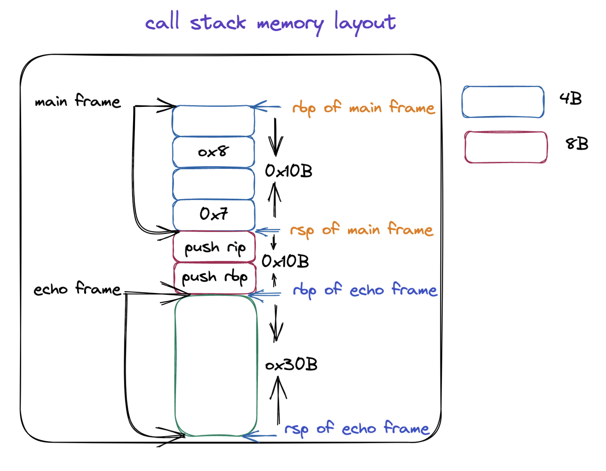

# OpenMP For Construct 实现原理和源码分析

## 前言

在本篇文章当中主要给大家介绍 OpenMp for construct 的实现原理，以及与他相关的动态库函数分析，与 for construct 非常相关的是循环的调度方式，在 OpenMP 当中一共有四种调调方式，auto, dynamic, guided, runtime, 在本篇文章当中将对四种方式进行仔细的分析。

## 前置知识

在介绍 for construct 的实现原理之前，我们首先需要了解一下编译器是如何处理函数参数传递的（本文基于 x86_64 ISA），我们来看一下下面的代码在编译之后函数参数的传递情况。

在前面的文章当中我们已经谈到过了，在 x86 当中参数传递的规约，具体的内容如下所示：

| 寄存器 | 含义       |
| ------ | ---------- |
| rdi    | 第一个参数 |
| rsi    | 第二个参数 |
| rdx    | 第三个参数 |
| rcx    | 第四个参数 |
| r8     | 第五个参数 |
| r9     | 第六个参数 |

我们现在使用下面的代码来分析一下具体的情况（因为前面使用寄存器只能够传递 6 个参数，而在后面我们要分析的动态库函数当中会传递 7 个参数，因此这里我们使用 8 个参数来测试一下具体的参数传递情况）：

```c

#include "stdio.h"

void echo(int a1, int a2, int a3, int a4, int a5, int a6, int a7, int a8)
{
  printf("%d %d %d %d %d %d %d %d\n", a8, a7, a1, a2, a3, a4, a5, a6);
}

int main()
{
  echo(1, 2, 3, 4 ,5 ,6, 7, 8);
  return 0;
}
```

上面的程序的反汇编结果如下所示：

```asm
000000000040053d <echo>:
  40053d:       55                      push   %rbp
  40053e:       48 89 e5                mov    %rsp,%rbp
  400541:       48 83 ec 30             sub    $0x30,%rsp
  400545:       89 7d fc                mov    %edi,-0x4(%rbp)
  400548:       89 75 f8                mov    %esi,-0x8(%rbp)
  40054b:       89 55 f4                mov    %edx,-0xc(%rbp)
  40054e:       89 4d f0                mov    %ecx,-0x10(%rbp)
  400551:       44 89 45 ec             mov    %r8d,-0x14(%rbp)
  400555:       44 89 4d e8             mov    %r9d,-0x18(%rbp)
  400559:       8b 7d f4                mov    -0xc(%rbp),%edi
  40055c:       8b 75 f8                mov    -0x8(%rbp),%esi
  40055f:       8b 55 fc                mov    -0x4(%rbp),%edx
  400562:       8b 45 18                mov    0x18(%rbp),%eax # a8
  400565:       8b 4d e8                mov    -0x18(%rbp),%ecx
  400568:       89 4c 24 10             mov    %ecx,0x10(%rsp)
  40056c:       8b 4d ec                mov    -0x14(%rbp),%ecx
  40056f:       89 4c 24 08             mov    %ecx,0x8(%rsp)
  400573:       8b 4d f0                mov    -0x10(%rbp),%ecx
  400576:       89 0c 24                mov    %ecx,(%rsp)
  400579:       41 89 f9                mov    %edi,%r9d
  40057c:       41 89 f0                mov    %esi,%r8d
  40057f:       89 d1                   mov    %edx,%ecx
  400581:       8b 55 10                mov    0x10(%rbp),%edx # a7
  400584:       89 c6                   mov    %eax,%esi # a8
  400586:       bf 64 06 40 00          mov    $0x400664,%edi
  40058b:       b8 00 00 00 00          mov    $0x0,%eax
  400590:       e8 8b fe ff ff          callq  400420 <printf@plt>
  400595:       c9                      leaveq 

0000000000400597 <main>:
  400597:       55                      push   %rbp
  400598:       48 89 e5                mov    %rsp,%rbp
  40059b:       48 83 ec 10             sub    $0x10,%rsp
  40059f:       c7 44 24 08 08 00 00    movl   $0x8,0x8(%rsp) # 保存参数 8 
  4005a6:       00 
  4005a7:       c7 04 24 07 00 00 00    movl   $0x7,(%rsp) # 保存参数 7 
  4005ae:       41 b9 06 00 00 00       mov    $0x6,%r9d # 保存参数 6 
  4005b4:       41 b8 05 00 00 00       mov    $0x5,%r8d # 保存参数 5 
  4005ba:       b9 04 00 00 00          mov    $0x4,%ecx # 保存参数 4 
  4005bf:       ba 03 00 00 00          mov    $0x3,%edx # 保存参数 3 
  4005c4:       be 02 00 00 00          mov    $0x2,%esi # 保存参数 2 
  4005c9:       bf 01 00 00 00          mov    $0x1,%edi # 保存参数 1
  4005ce:       e8 6a ff ff ff          callq  40053d <echo>
  4005d3:       b8 00 00 00 00          mov    $0x0,%eax
  4005d8:       c9                      leaveq 
  4005d9:       c3                      retq   
  4005da:       66 0f 1f 44 00 00       nopw   0x0(%rax,%rax,1)
```

从上面的汇编程序我们可以知道 1 - 6，这几个参数确实是通过寄存器传递的，对应的寄存器就是上文当中我们提到不同的参数对应的寄存器。但是参数 7 和参数 8 是保存在栈上的。根据上面的 main 函数的汇编程序分析，他对应的栈帧的内存布局如下所示：



我们在来分析一下 echo 函数当中 printf 函数参数的传递情况，第二个参数和第三个参数分别是 a8, a7，应该分别保存到寄存器 rsi/esi, rdx/edx 当中，在上面的汇编代码当中已经使用注释的方式进行标注出来了，从下往上进行分析可以看到 a8 保存在位置 0x18(%rbp)，a7 保存在 0x10(%rbp)，这个地址正是 main 函数保存 a7（当进入函数 echo 之后，a7，和 a8 的位置分别是 rsp + 0x10）, a8（当进入函数 echo 之后，a7，和 a8 的位置分别是 rsp + 0x10 + 0x8） 的位置，具体可以结合上面的内存布局图进行分析。

## dynamic 调度方式分析

我们使用下面的代码来分析一下动态调度的情况下整个程序的执行流程是怎么样的：
```c
#include <stdio.h>
#include <omp.h>

int main()
{
#pragma omp parallel for num_threads(4) default(none) schedule(dynamic, 1)
  for(int i = 0; i < 12; ++i)
  {
    printf("i = %d tid = %d\n", i, omp_get_thread_num());
  }
  return 0;
}
```

编译器会将上面的程序编译成下面的形式：

```c
void subfunction (void *data)
{
  long _s0, _e0;
  while (GOMP_parallel_loop_dynamic_start (&_s0, &_e0))
  {
    long _e1 = _e0, i;
    for (i = _s0; i < _e1; i++)
      body;
  }
  GOMP_loop_end_nowait ();
}

GOMP_parallel_loop_dynamic_start (subfunction, NULL, 0, lb, ub+1, 1, 0);
subfunction (NULL);
GOMP_parallel_end ();
```

在上面的程序当中 GOMP_parallel_loop_dynamic_start，有 7 个参数，我们接下来仔细解释一下这七个参数的含义：

- fn，函数指针也就是并行域被编译之后的函数。
- data，指向共享或者私有的数据，在并行域当中可能会使用外部的一些变量。
- num_threads，并行域当中指定启动线程的个数。
- start，for 循环迭代的初始值，比如 for(int i = 0; ;) 这个 start 就是 0 。
- end，for 循环迭代的最终值，比如 for(int i = 0; i < 100; i++) 这个 end 就是 100 。
- incr，这个值一般都是 1 。
- chunk_size，这个就是给一个线程划分块的时候一个块的大小，比如 schedule(dynamic, 1)，这个 chunk_size 就等于 1 。

```c
void
GOMP_parallel_loop_dynamic_start (void (*fn) (void *), void *data,
				  unsigned num_threads, long start, long end,
				  long incr, long chunk_size)
{
  gomp_parallel_loop_start (fn, data, num_threads, start, end, incr,
			    GFS_DYNAMIC, chunk_size);
}

```


```c
static void
gomp_parallel_loop_start (void (*fn) (void *), void *data,
			  unsigned num_threads, long start, long end,
			  long incr, enum gomp_schedule_type sched,
			  long chunk_size)
{
  struct gomp_team *team;

  num_threads = gomp_resolve_num_threads (num_threads, 0);
  team = gomp_new_team (num_threads);
  gomp_loop_init (&team->work_shares[0], start, end, incr, sched, chunk_size);
  gomp_team_start (fn, data, num_threads, team);
}
```


