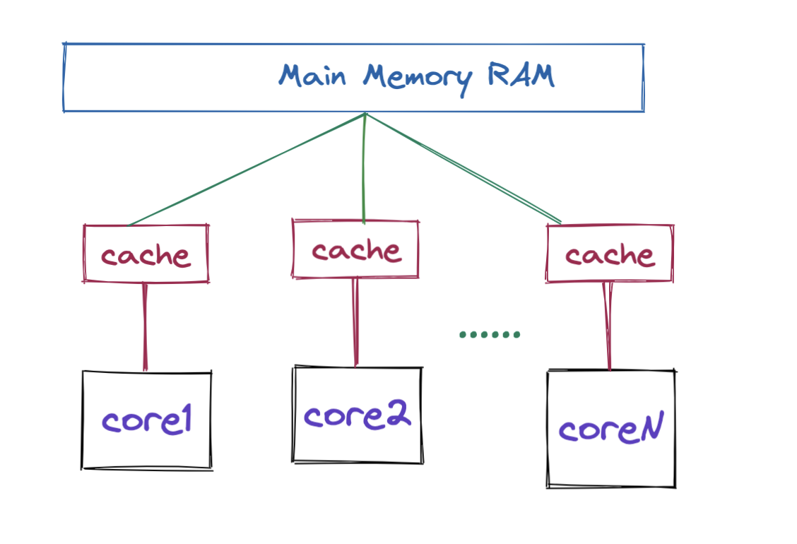
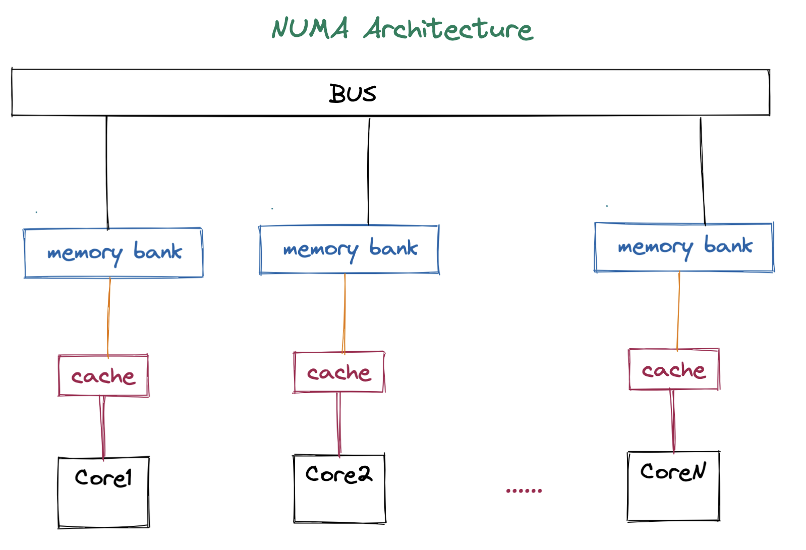
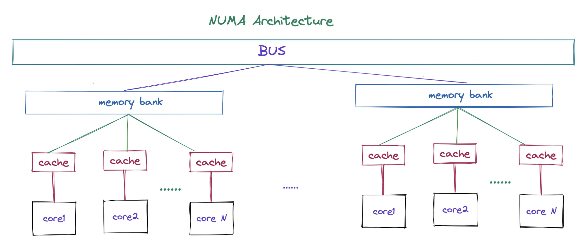

# 深入剖析 OpenMP 线程绑定与 NUMA 架构

## 前言

在本篇文章当中主要给大家深入分析 OpenMP 当中的线程绑定，但是随着体系结构的不断发展，现代处理器和以前经典的处理器结构已经发生了变化了，本篇文章在着重分析线程绑定的同时，将仔细分析 NUMA 架构和线程绑定之间的关系，已经它可能对性能存在的影响。









```shell
➜  ~ numactl --hardware
available: 2 nodes (0-1)
node 0 cpus: 0 2 4 6 8 10 12 14 16 18 20 22 24 26 28 30 32 34 36 38 40 42 44 46 48 50 52 54
node 0 size: 64326 MB
node 0 free: 13717 MB
node 1 cpus: 1 3 5 7 9 11 13 15 17 19 21 23 25 27 29 31 33 35 37 39 41 43 45 47 49 51 53 55
node 1 size: 64498 MB
node 1 free: 25223 MB
node distances:
node   0   1
  0:  10  21
  1:  21  10
```

