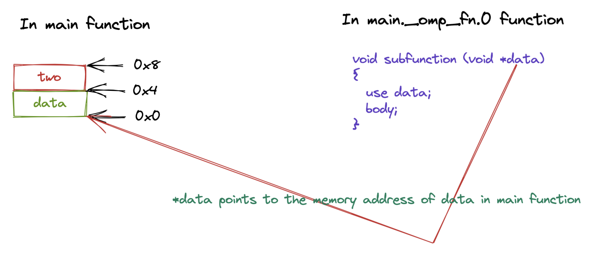

# OpenMP Parallel Construct 实现原理与源码分析

## 前言

在本篇文章当中我们将主要分析 OpenMP 当中的 parallel construct 具体时如何实现的，以及这这个 construct 调用了哪些运行时库函数！

## Parallel 分析——编译器角度

在本小节当中我们将从编译器的角度去分析该如何处理 parallel construct 。首先从词法分析和语法分析的角度来说这对编译器并不难，只需要加上一些处理规则，关键是编译器将一个 parallel construct 具体编译成了什么？

下面是一个非常简单的 parallel construct。

```c
#pragma omp parallel
{
  body;
}
```

编译器在遇到上面的 parallel construct 之后会将代码编译成下面的样子：

```c
void subfunction (void *data)
{
  use data;
  body;
}

setup data;
GOMP_parallel_start (subfunction, &data, num_threads);
subfunction (&data);
GOMP_parallel_end ();
```

首先 parallel construct 中的代码块会被编译成一个函数 sub function，当然了函数名不一定是这个，然后会在使用 `#pragma omp parallel` 的函数当中将一个 parallel construct 编译成 OpenMP 动态库函数的调用，在上面的伪代码当中也指出了，具体会调用 OpenMP 的两个库函数 GOMP_parallel_start 和 GOMP_parallel_end ，并且主线程也会调用函数 subfunction ，我们在后面的文章当中在仔细分析这两个动态库函数的源代码。

## 深入剖析 Parallel 动态库函数参数传递

### 动态库函数分析

在本小节当中，我们主要去分析一下在 OpenMP 当中共享参数是如何传递的，以及介绍函数 GOMP_parallel_start 的几个参数的含义。

首先我们分析函数 GOMP_parallel_start 的参数含义，这个函数的函数原型如下：

```c
void GOMP_parallel_start (void (*fn)(void *), void *data, unsigned num_threads)
```

上面这个函数一共有三个参数：

- 第一个参数 fn 是一个函数指针，主要是用于指向上面编译出来的 subfunction 这个函数的，因为需要多个线程同时执行这个函数，因此需要将这个函数传递过去，让不同的线程执行。
- 第二个参数是传递的数据，我们在并行域当中会使用到共享的或者私有的数据，这个指针主要是用于传递数据的，我们在后面会仔细分析这个参数的使用。
- 第三个参数是表示 num_threads 子句指定的线程个数，如果不指定这个子句默认的参数是 0 ，但是如果你使用了 IF 子句并且条件是 false 的话，那么这个参数的值就是 1 。
- 这个函数的主要作用是启动一个或者多个线程，并且执行函数 fn 。

```c
void GOMP_parallel_end (void)
```

- 这个函数的主要作用是进行线程的同步，因为一个 parallel 并行域需要等待所有的线程都执行完成之后才继续往后执行。除此之外还需要释放线程组的资源并行返回到之前的 omp_in_parallel() 表示的状态。

### 参数传递分析

我们现在使用下面的代码来具体分析参数传递过程：

```c

#include <stdio.h>
#include "omp.h"

int main()
{
  int data = 100;
  int two  = -100;
  printf("start\n");
#pragma omp parallel num_threads(4) default(none) shared(data, two)
  {
    printf("tid = %d data = %d two = %d\n", omp_get_thread_num(), data, two);
  }

  printf("finished\n");
  return 0;
}
```

我们首先来分析一下上面的两个变量 data 和 two 的是如何被传递的，我们首先用图的方式进行表示，然后分析一下汇编程序并且对图进行验证。

上面的代码当中两个变量 `data` 和 `two` 在内存当中的布局结构大致如下所示（假设 data 的初始位置时 0x0）：


那么在函数 GOMP_parallel_start 当中传递的参数 data 就是 0x0 也就是指向 data 的内存地址，如下图所示：



那么根据上面参数传递的情况，我们就可以在 subfunction 当中使用 \*(int\*)data 得到 data 的值，使用 \*((int\*) ((char\*)data + 4)) 得到 two 的值，如果是 private 传递的话我们就可以先拷贝这个数据再使用，如果是 shared 的话，那么我们就可以直接使用指针就行啦。

## 汇编程序分析

| 寄存器 | 含义       |
| ------ | ---------- |
| rdi    | 第一个参数 |
| rsi    | 第二个参数 |
| rdx    | 第三个参数 |
| rcx    | 第四个参数 |
| r8     | 第五个参数 |
| r9     | 第六个参数 |

上面的程序我们用 pthread 大致描述一下，则 pthread 对应的代码如下所示：

```c


#include "pthread.h"
#include "stdio.h"
#include "stdint.h"

typedef struct data_in_main_function{
    int data;
    int two;
}data_in_main_function;

pthread_t threads[4];

void subfunction(void* data)
{
  int two = ((data_in_main_function*)data)->two;
  int data_ = ((data_in_main_function*)data)->data;
  printf("tid = %ld data = %d two = %d\n", pthread_self(), data_, two);
}

int main()
{
  // 在主函数申请 8 个字节的栈空间
  data_in_main_function data;
  data.data = 100;
  data.two = -100;
  for(int i = 0; i < 4; ++i)
  {
    pthread_create(&threads[i], NULL, subfunction, &data);
  }
  for(int i = 0; i < 4; ++i)
  {
    pthread_join(threads[i], NULL);
  }
  return 0;
}
```


```asm
00000000004006cd <main>:
  4006cd:       55                      push   %rbp
  4006ce:       48 89 e5                mov    %rsp,%rbp
  4006d1:       48 83 ec 10             sub    $0x10,%rsp
  4006d5:       c7 45 fc 64 00 00 00    movl   $0x64,-0x4(%rbp)
  4006dc:       bf f0 07 40 00          mov    $0x4007f0,%edi
  4006e1:       e8 9a fe ff ff          callq  400580 <puts@plt>
  4006e6:       8b 45 fc                mov    -0x4(%rbp),%eax
  4006e9:       89 45 f0                mov    %eax,-0x10(%rbp)
  4006ec:       48 8d 45 f0             lea    -0x10(%rbp),%rax
  4006f0:       ba 04 00 00 00          mov    $0x4,%edx
  4006f5:       48 89 c6                mov    %rax,%rsi
  4006f8:       bf 2a 07 40 00          mov    $0x40072a,%edi
  4006fd:       e8 6e fe ff ff          callq  400570 <GOMP_parallel_start@plt>
  400702:       48 8d 45 f0             lea    -0x10(%rbp),%rax
  400706:       48 89 c7                mov    %rax,%rdi
  400709:       e8 1c 00 00 00          callq  40072a <main._omp_fn.0>
  40070e:       e8 7d fe ff ff          callq  400590 <GOMP_parallel_end@plt>
  400713:       8b 45 f0                mov    -0x10(%rbp),%eax
  400716:       89 45 fc                mov    %eax,-0x4(%rbp)
  400719:       bf f6 07 40 00          mov    $0x4007f6,%edi
  40071e:       e8 5d fe ff ff          callq  400580 <puts@plt>
  400723:       b8 00 00 00 00          mov    $0x0,%eax
  400728:       c9                      leaveq 
  400729:       c3                      retq 
  
  
000000000040072a <main._omp_fn.0>:
  40072a:       55                      push   %rbp
  40072b:       48 89 e5                mov    %rsp,%rbp
  40072e:       48 83 ec 10             sub    $0x10,%rsp
  400732:       48 89 7d f8             mov    %rdi,-0x8(%rbp)
  400736:       e8 65 fe ff ff          callq  4005a0 <omp_get_thread_num@plt>
  40073b:       48 8b 55 f8             mov    -0x8(%rbp),%rdx
  40073f:       8b 12                   mov    (%rdx),%edx
  400741:       89 c6                   mov    %eax,%esi
  400743:       bf ff 07 40 00          mov    $0x4007ff,%edi
  400748:       b8 00 00 00 00          mov    $0x0,%eax
  40074d:       e8 5e fe ff ff          callq  4005b0 <printf@plt>
  400752:       c9                      leaveq 
  400753:       c3                      retq   
  400754:       66 2e 0f 1f 84 00 00    nopw   %cs:0x0(%rax,%rax,1)
  40075b:       00 00 00 
  40075e:       66 90                   xchg   %ax,%ax

```

