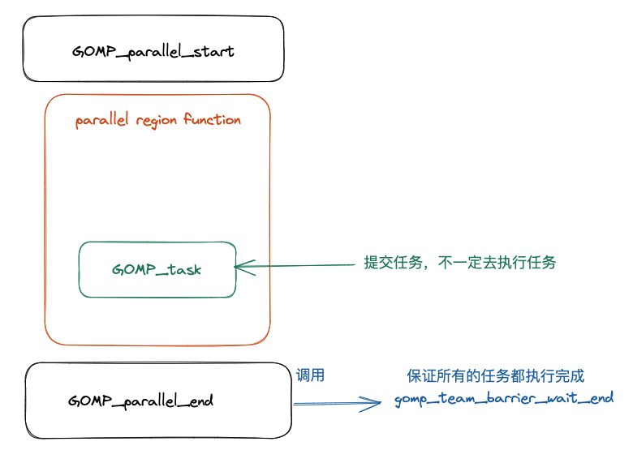

# OpenMP task construct 实现原理以及源码分析

## 前言

在本篇文章当中主要给大家介绍在 OpenMP 当中 task 的实现原理，以及他调用的相关的库函数的具体实现。在本篇文章当中最重要的就是理解整个 OpenMP 的运行机制。

## 从编译器角度看 task construct

在本小节当中主要给大家分析一下编译器将 openmp 的 task construct 编译成什么样子，下面是一个 OpenMP 的 task 程序例子：

```c
#include <stdio.h>
#include <omp.h>

int main()
{

#pragma omp parallel num_threads(4) default(none)
  {
#pragma omp task default(none)
    {
       printf("Hello World from tid = %d\n", omp_get_thread_num());
    }
  }
  return 0;
}
```

首先先捋一下整个程序被编译之后的执行流程，经过前面的文章的学习，我们已经知道了并行域当中的代码会被编译器编译成一个函数，关于这一点我们已经在前面的很多文章当中已经讨论过了，就不再进行复述。事实上 task construct 和 parallel construct 一样，task construct 也会被编译成一个函数，同样的这个函数也会被作为一个参数传递给 OpenMP 内部，被传递的这个函数可能被立即执行，也可能在函数 GOMP_parallel_end 被调用后，在到达同步点之前执行被执行（线程在到达并行域的同步点之前需要保证所有的任务都被执行完成）。整个过程大致如下图所示：



任务的结构体描述如下所示：

```c
struct gomp_task
{
  struct gomp_task *parent;	// 任务的父亲任务
  struct gomp_task *children;	// 子任务
  struct gomp_task *next_child;	// 
  struct gomp_task *prev_child;
  struct gomp_task *next_queue;
  struct gomp_task *prev_queue;
  struct gomp_task_icv icv;
  void (*fn) (void *);	// 编译之后的函数
  void *fn_data;				// 函数参数
  enum gomp_task_kind kind; // 任务类型 具体类型如下面的枚举类型
  bool in_taskwait;	// 是否处于 taskwait 状态
  bool in_tied_task; // 是不是在绑定任务当中
  bool final_task; // 是不是最终任务
  gomp_sem_t taskwait_sem; // 对象锁 用于保证线程操作这个数据的时候的线程安全
};

enum gomp_task_kind
{
  GOMP_TASK_IMPLICIT,
  GOMP_TASK_IFFALSE,
  GOMP_TASK_WAITING,
  GOMP_TASK_TIED
};

```


对应的反汇编程序如下所示：

```asm
00000000004008ad <main>:
  4008ad:       55                      push   %rbp
  4008ae:       48 89 e5                mov    %rsp,%rbp
  4008b1:       ba 04 00 00 00          mov    $0x4,%edx
  4008b6:       be 00 00 00 00          mov    $0x0,%esi
  4008bb:       bf db 08 40 00          mov    $0x4008db,%edi
  4008c0:       e8 8b fe ff ff          callq  400750 <GOMP_parallel_start@plt>
  4008c5:       bf 00 00 00 00          mov    $0x0,%edi
  4008ca:       e8 0c 00 00 00          callq  4008db <main._omp_fn.0>
  4008cf:       e8 8c fe ff ff          callq  400760 <GOMP_parallel_end@plt>
  4008d4:       b8 00 00 00 00          mov    $0x0,%eax
  4008d9:       5d                      pop    %rbp
  4008da:       c3                      retq

00000000004008db <main._omp_fn.0>:
  4008db:       55                      push   %rbp
  4008dc:       48 89 e5                mov    %rsp,%rbp
  4008df:       48 83 ec 10             sub    $0x10,%rsp
  4008e3:       48 89 7d f8             mov    %rdi,-0x8(%rbp)
  4008e7:       c7 04 24 00 00 00 00    movl   $0x0,(%rsp)		# 参数 flags
  4008ee:       41 b9 01 00 00 00       mov    $0x1,%r9d			# 参数 if_clause
  4008f4:       41 b8 01 00 00 00       mov    $0x1,%r8d			# 参数 arg_align
  4008fa:       b9 00 00 00 00          mov    $0x0,%ecx			# 参数 arg_size
  4008ff:       ba 00 00 00 00          mov    $0x0,%edx			# 参数 cpyfn
  400904:       be 00 00 00 00          mov    $0x0,%esi			# 参数 data
  400909:       bf 15 09 40 00          mov    $0x400915,%edi # 这里就是调用函数 main._omp_fn.1
  40090e:       e8 9d fe ff ff          callq  4007b0 <GOMP_task@plt>
  400913:       c9                      leaveq
  400914:       c3                      retq

0000000000400915 <main._omp_fn.1>:
  400915:       55                      push   %rbp
  400916:       48 89 e5                mov    %rsp,%rbp
  400919:       48 83 ec 10             sub    $0x10,%rsp
  40091d:       48 89 7d f8             mov    %rdi,-0x8(%rbp)
  400921:       e8 4a fe ff ff          callq  400770 <omp_get_thread_num@plt>
  400926:       89 c6                   mov    %eax,%esi
  400928:       bf d0 09 40 00          mov    $0x4009d0,%edi
  40092d:       b8 00 00 00 00          mov    $0x0,%eax
  400932:       e8 49 fe ff ff          callq  400780 <printf@plt>
  400937:       c9                      leaveq
  400938:       c3                      retq
  400939:       0f 1f 80 00 00 00 00    nopl   0x0(%rax)
```

```c
void
GOMP_task (void (*fn) (void *), void *data, void (*cpyfn) (void *, void *),
	   long arg_size, long arg_align, bool if_clause, unsigned flags)
```

```c

#include <stdio.h>
#include <omp.h>

int main()
{

#pragma omp parallel num_threads(4) default(none)
  {
     int data = omp_get_thread_num();
#pragma omp task default(none) firstprivate(data)
    {
       printf("data = %d Hello World from tid = %d\n", data, omp_get_thread_num());
    }
  }
  return 0;
}
```

```c

/* Called when encountering an explicit task directive.  If IF_CLAUSE is
   false, then we must not delay in executing the task.  If UNTIED is true,
   then the task may be executed by any member of the team.  */

void
GOMP_task (void (*fn) (void *), void *data, void (*cpyfn) (void *, void *),
	   long arg_size, long arg_align, bool if_clause, unsigned flags)
{
  struct gomp_thread *thr = gomp_thread ();
  struct gomp_team *team = thr->ts.team;

#ifdef HAVE_BROKEN_POSIX_SEMAPHORES
  /* If pthread_mutex_* is used for omp_*lock*, then each task must be
     tied to one thread all the time.  This means UNTIED tasks must be
     tied and if CPYFN is non-NULL IF(0) must be forced, as CPYFN
     might be running on different thread than FN.  */
  if (cpyfn)
    if_clause = false;
  if (flags & 1)
    flags &= ~1;
#endif

  if (!if_clause || team == NULL
      || (thr->task && thr->task->final_task)
      || team->task_count > 64 * team->nthreads)
    {
      struct gomp_task task;

      gomp_init_task (&task, thr->task, gomp_icv (false));
      task.kind = GOMP_TASK_IFFALSE;
      task.final_task = (thr->task && thr->task->final_task) || (flags & 2);
      if (thr->task)
	task.in_tied_task = thr->task->in_tied_task;
      thr->task = &task;
      if (__builtin_expect (cpyfn != NULL, 0))
	{
	  char buf[arg_size + arg_align - 1];
	  char *arg = (char *) (((uintptr_t) buf + arg_align - 1)
				& ~(uintptr_t) (arg_align - 1));
	  cpyfn (arg, data);
	  fn (arg);
	}
      else
	fn (data);
      /* Access to "children" is normally done inside a task_lock
	 mutex region, but the only way this particular task.children
	 can be set is if this thread's task work function (fn)
	 creates children.  So since the setter is *this* thread, we
	 need no barriers here when testing for non-NULL.  We can have
	 task.children set by the current thread then changed by a
	 child thread, but seeing a stale non-NULL value is not a
	 problem.  Once past the task_lock acquisition, this thread
	 will see the real value of task.children.  */
      if (task.children != NULL)
	{
	  gomp_mutex_lock (&team->task_lock);
	  gomp_clear_parent (task.children);
	  gomp_mutex_unlock (&team->task_lock);
	}
      gomp_end_task ();
    }
  else
    {
      struct gomp_task *task;
      struct gomp_task *parent = thr->task;
      char *arg;
      bool do_wake;

      task = gomp_malloc (sizeof (*task) + arg_size + arg_align - 1);
      arg = (char *) (((uintptr_t) (task + 1) + arg_align - 1)
		      & ~(uintptr_t) (arg_align - 1));
      gomp_init_task (task, parent, gomp_icv (false));
      task->kind = GOMP_TASK_IFFALSE;
      task->in_tied_task = parent->in_tied_task;
      thr->task = task;
      if (cpyfn)
	cpyfn (arg, data);
      else
	memcpy (arg, data, arg_size);
      thr->task = parent;
      task->kind = GOMP_TASK_WAITING;
      task->fn = fn;
      task->fn_data = arg;
      task->in_tied_task = true;
      task->final_task = (flags & 2) >> 1;
      gomp_mutex_lock (&team->task_lock);
      if (parent->children)
	{
	  task->next_child = parent->children;
	  task->prev_child = parent->children->prev_child;
	  task->next_child->prev_child = task;
	  task->prev_child->next_child = task;
	}
      else
	{
	  task->next_child = task;
	  task->prev_child = task;
	}
      parent->children = task;
      if (team->task_queue)
	{
	  task->next_queue = team->task_queue;
	  task->prev_queue = team->task_queue->prev_queue;
	  task->next_queue->prev_queue = task;
	  task->prev_queue->next_queue = task;
	}
      else
	{
	  task->next_queue = task;
	  task->prev_queue = task;
	  team->task_queue = task;
	}
      ++team->task_count;
      gomp_team_barrier_set_task_pending (&team->barrier);
      do_wake = team->task_running_count + !parent->in_tied_task
		< team->nthreads;
      gomp_mutex_unlock (&team->task_lock);
      if (do_wake)
	gomp_team_barrier_wake (&team->barrier, 1);
    }
}

```


